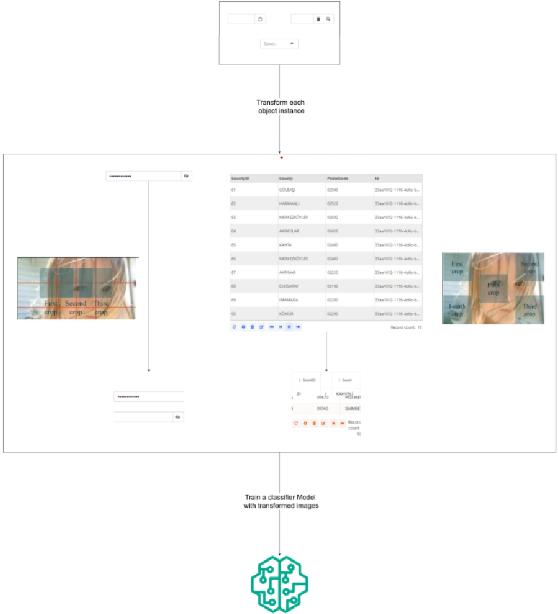
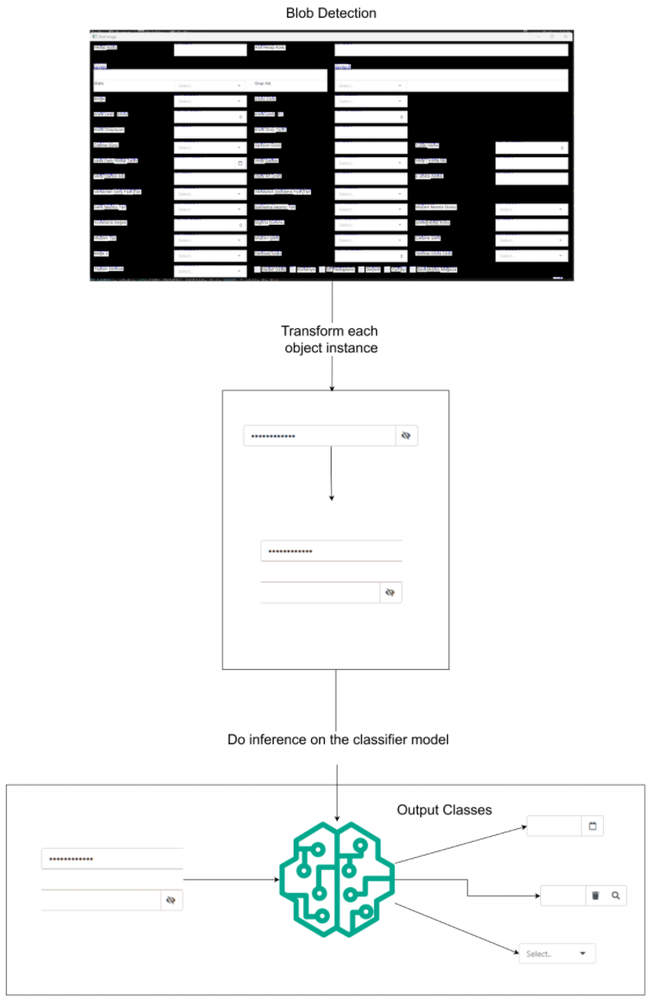

# Element-Classification-With-Feature-Engineering

*This repository uses feature engineering method to classify form compononents. This is not the state of the art method however is a good example for handcrafting features.*

* Blobs that are conjoined may be misclassified

Elongated objects have distinctive features only in the start, middle and in the end. For that reason three crop is appropriate.

Objects that have close aspect ratio to 1 is can be represented with five-crop more accurately.

