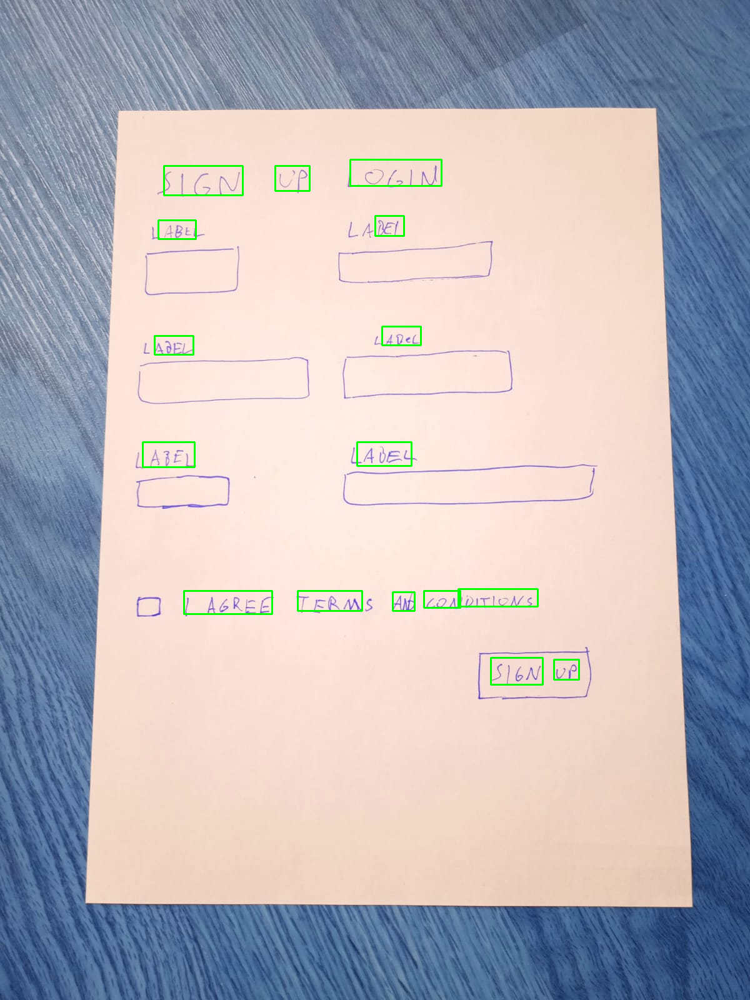
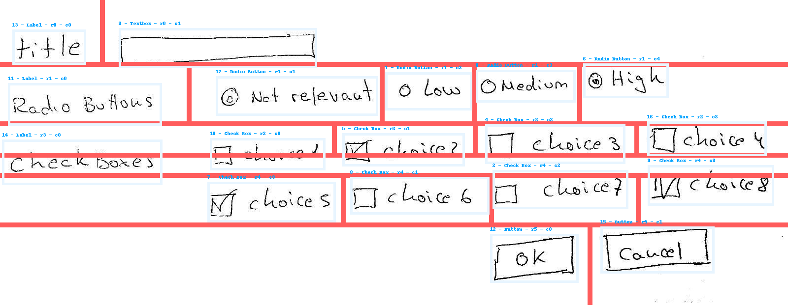
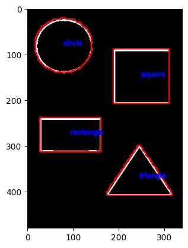

# Tools for document processing

*This repository has various tools that might be useful in document processing such as text detection, shape detector, pixel to grid layout transformer and a debug script for camera inference*

